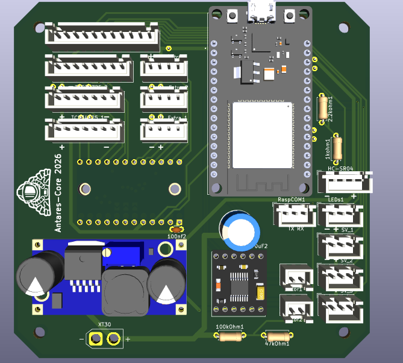
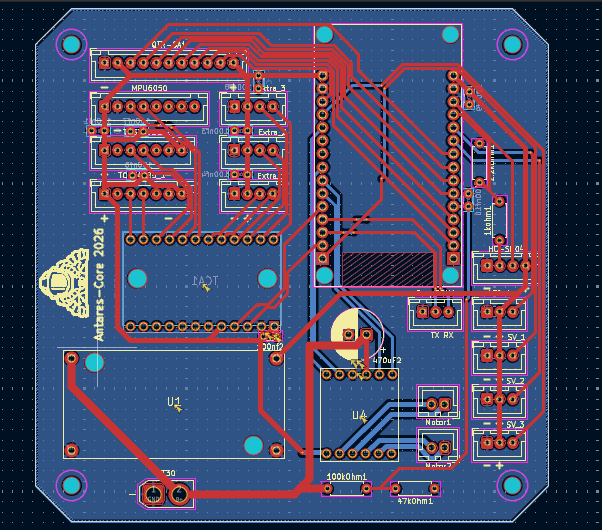

# ⚡ Astro-Core PCB

Placa de controle baseada em **ESP32**, projetada para a equipe de robótica competitiva OBR **AstroTech**.

---

## 💡 O que é este projeto

Este projeto foi feito com o intuito de criar um módulo central de sensores, controle, motores e monitoramento de um robô OBR.
Este repositório contém todos os arquivos de hardware (PCB e esquemáticos) desta placa.

---

## 🖼️ Renderização 3D da Placa

---

## 📌 Esquemático — Visão Geral

---

## 📜 Licença

Este projeto está sob a licença **MIT**.  
Veja o arquivo [LICENSE](LICENSE) para mais detalhes.

---

## 👤 Autor

Feito por **Elias Freire**  
GitHub: https://github.com/Freire-Elias

